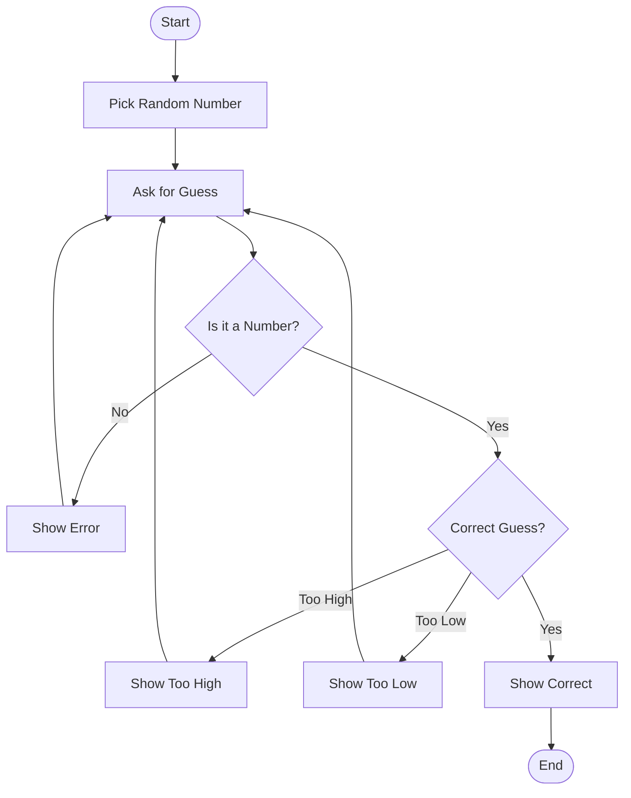

## Descriptions For Each Step
- **Start**: The game begins.
- **Pick Random Number**: The computer chooses a number within a range (A reasonable range like 1 to 100).
- **Ask for Guess**: The user is asked to enter a number.
- **Correct Guess?**: The program checks if the user’s guess matches the random number.
- **Show Too High**: If the guess is higher than the correct number, the program tells the user it’s too high.
- **Show Too Low**: If the guess is lower than the correct number, the program tells the user it’s too low.
- **Show Correct**: If the guess is correct, the program tells the user that it's correct.
- **End**: The game ends.
